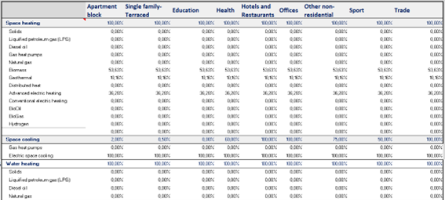
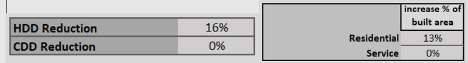
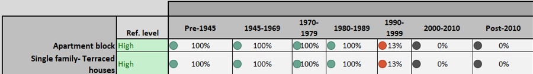

# iDesignRES: Building Stock Energy Model

## Use Case full example: Basque Country (NUTS2 ES21)

As mentioned in [Implemented features](../README.md#implemented-features) section, it is necessary to clarify that at the current stage of development, only the *ES21* region is available for processing.

First, a **geoprocessing workflow** is executed to obtain the required geometric and building stock data for the BSEM module. This process is fully automated and generates the input CSV file containing all relevant information described above.

Once the data is generated, the results of the geoprocessing are validated against real-world data:

- On the one hand, **total residential floor areas and the number of dwellings** are compared with official statistical data.

- On the other hand, results for the **city of Bilbao** are compared against cadastral data.

Both comparisons show only minimal deviations. It is not possible to perform a more detailed validation, since building stock data at the required level of disaggregation is not available at the regional scale.

1. In addition to the geometric information, the model requires a set of input parameters related to energy systems and fuels. These parameters are defined in the *input.json* file.

For each building use or sector, the following are defined:

- The **fuel mix** (share of fuels used for each final energy use).

- The **percentage of buildings** equipped with each system.

For the Basque Country case study, these values were derived mainly from regional statistical sources. Where specific data was not available, the tool relies on an **internal
database of default values** defined at the national.

With these inputs, the **baseline year scenario** can be simulated for the case study.

To model the **2050 scenario**, the same process is followed but with additional  parameters describing the target year. These parameters are informed by existing regional strategies, such as the **2030 Energy Transition and Climate Change Strategy for the Basque Country**, as well as the **2050 Roadmap and decarbonisation scenarios**. From these narratives, the required input values are extracted.

As in the baseline, fuel mixes and system shares are defined for each building use or sector.



In addition, further parameters are introduced, such as:

- The evolution of **Heating Degree Days (HDD)** and **Cooling Degree Days  CDD)**.

- The projected growth of **residential and non-residential floor area**.

- The **renovation rate of the existing building stock**, differentiated by use and construction period.





It should be noted that these parameters also exist for the base year in input.json, but their values will be set to 0.

Once all parameters are defined, the model can simulate the **target-year scenario** and compare the results against those of the baseline year.

---

#### Execution

---

The Building Stock Energy Model uses two main types of input data:

1. **Parameters defined in the *input.json* file**.

2. **Building data obtained from a prior geoprocessing step**, stored in two different CSV files named according to the NUTS2 region code (*ES21_preprocess.csv* and *ES21_solar.csv*), both for the Building Stock Energy Model itself and for the solar module for buildings included as part of the Building Stock Energy Model.
   
   ---

The CSV file contains aggregated information on buildings, classified by archetypes and grouped into **seven construction periods**, resulting in a total of **98 archetypes**:

- **28 archetypes for residential apartment buildings**: 4 archetypes for each of the 7 construction periods.

- **21 archetypes for single-family houses**: 3 archetypes for each construction period.

- **49 archetypes for non-residential buildings**: covering 7 building uses, with 1 archetype per construction period.

Each archetype includes aggregated geometric characteristics such as:

- Built floor area. [m2]

- Number of floors and average height. [-]

- Building volume. [m3]

- Total built area. [m2]

- Total exterior façade area. [m2]

This dataset represents the **building stock of the selected region**.

#### **<u>Solar building energy model</u>**

It’s a **spatial inventory of usable solar potential**, broken down by **region** and **radiation intensity band**.

The solar building energy model uses two main types of input data:

1. **Parameters defined in the *input.json* file**.

2. **Radiation data obtained from a prior geoprocessing step**, stored in a CSV file named according to the NUTS2 region code (*ES21_solar.csv*).

Radiation data is obtained from a previous geoprocessing operation combining several
layers, such as global incident solar radiation (GHI), soil and environmental protection, land use and slope, to identify the most suitable areas for installation, excluding those where it is not possible to do so.

This process provides a CSV file that will be used as input for the solar generation model for large plants. In this case, the analysis is carried out at the NUTS3 region level to consider possible changes in terrain and radiation.

The generated CSV provides, for each NUTS3 region, the **distribution of available area according to solar radiation levels**, starting from 700 **kWh/m²·year (value previously defined as a threshold)**.

It provides the information about:

- **Where** suitable surfaces are,

- **How much area** they represent, and

- **What level of solar radiation** they receive.

Each **row** in the CSV corresponds to:

- One **NUTS3 region**, and

- One **radiation band** (e.g., 700–800, 800–900, …).

| Column                                 | Description                                                                                                                                   | Units / Type        |
| -------------------------------------- | --------------------------------------------------------------------------------------------------------------------------------------------- | ------------------- |
| Region                                 | NUTS3 code of the subregion                                                                                                                   | Text                |
| Centroid_X, Centroid_Y                 | Longitude and latitude of the region centroid                                                                                                 | Degrees (EPSG:4326) |
| Total_Area                             | Total geometric area of the region                                                                                                            | m²                  |
| Max_Radiation                          | Maximum radiation value within the region                                                                                                     | kWh/m²·year         |
| Average_Radiation                      | Mean radiation value within the region                                                                                                        | kWh/m²·year         |
| Threshold                              | Lower limit of the radiation band (700, 800, 900, …)                                                                                          | Numeric             |
| Area_m2                                | Area (m²) within that radiation band [Threshold, Threshold+100) that meets all filters (valid land use, non-protected, slope below threshold) | m²                  |
| Median_Radiation                       | Median radiation value within that band                                                                                                       | kWh/m²·year         |
| Median_Radiation_X, Median_Radiation_Y | Coordinates (lon/lat) of the pixel closest to the median radiation value                                                                      | Degrees (EPSG:4326) |

#### <u>**How to interpret it**</u>

Each row represents a **solar potential band** within a NUTS3 region.

```
Region = ES123, Threshold = 800, Area_m2 = 1,250,000, Median_Radiation = 84
```

In region **ES123**, there are **1.25 km²** of usable area with solar radiation between **800 and 900 kWh/m²·year**, and the median value of that band is **845 kWh/m²·year**.

Based on this representation, the model performs the **energy characterization of buildings**, estimating both the energy demand and the expected energy consumption.

The combination of the structured archetype approach and the detailed geometric parameters enables the model to provide a scalable and region-specific assessment of building energy performance.

Regarding the information contained in the *input.json* file, it defines the execution scenario as follows:

```
{
    "nutsid": "ES21",
    "year": 2019,
    "scenario": {
        "increase_residential_built_area": 0.13,
        "increase_service_built_area": 0,
        "hdd_reduction": 0.16,
        "cdd_reduction": 0,
        "active_measures": [
            {
                "building_use": "Apartment Block",
                "user_defined_data": true,
                "space_heating": {
                    "pct_build_equipped": 1,
                    "solids": 0,
                    "lpg": 0,
                    "diesel_oil": 0,
                    "gas_heat_pumps": 0,
                    "natural_gas": 0,
                    "biomass": 0.5363,
                    "geothermal": 0.1016,
                    "distributed_heat": 0,
                    "advanced_electric_heating": 0.3621,
                    "conventional_electric_heating": 0,
                    "bio_oil": 0,
                    "bio_gas": 0,
                    "hydrogen": 0,
                    "electricity_in_circulation": 0
                },
                "space_cooling": {
                    "pct_build_equipped": 0.02,
                    "gas_heat_pumps": 0,
                    "electric_space_cooling": 1
                },
                "water_heating": {
                    "pct_build_equipped": 1,
                    "solids": 0,
                    "lpg": 0,
                    "diesel_oil": 0,
                    "natural_gas": 0,
                    "biomass": 0.4914,
                    "geothermal": 0.0885,
                    "distributed_heat": 0,
                    "advanced_electric_heating": 0.3096,
                    "bio_oil": 0,
                    "bio_gas": 0,
                    "hydrogen": 0,
                    "solar": 0.1105,
                    "electricity": 0
                },
                "cooking": {
                    "pct_build_equipped": 1,
                    "solids": 0,
                    "lpg": 0,
                    "natural_gas": 0,
                    "biomass": 0,
                    "electricity": 1
                },
                "lighting": {
                    "pct_build_equipped": 1,
                    "electricity": 1
                },
                "appliances": {
                    "pct_build_equipped": 1,
                    "electricity": 1
                }
            },
            {
                "building_use": "Single family- Terraced houses",
                "user_defined_data": true,
                "space_heating": {
                    "pct_build_equipped": 1,
                    "solids": 0,
                    "lpg": 0,
                    "diesel_oil": 0,
                    "gas_heat_pumps": 0,
                    "natural_gas": 0,
                    "biomass": 0.5363,
                    "geothermal": 0.1016,
                    "distributed_heat": 0,
                    "advanced_electric_heating": 0.3621,
                    "conventional_electric_heating": 0,
                    "bio_oil": 0,
                    "bio_gas": 0,
                    "hydrogen": 0,
                    "electricity_in_circulation": 0
                },
                "space_cooling": {
                    "pct_build_equipped": 0.005,
                    "gas_heat_pumps": 0,
                    "electric_space_cooling": 1
                },
                "water_heating": {
                    "pct_build_equipped": 1,
                    "solids": 0,
                    "lpg": 0,
                    "diesel_oil": 0,
                    "natural_gas": 0,
                    "biomass": 0.4914,
                    "geothermal": 0.0885,
                    "distributed_heat": 0,
                    "advanced_electric_heating": 0.3096,
                    "bio_oil": 0,
                    "bio_gas": 0,
                    "hydrogen": 0,
                    "solar": 0.1105,
                    "electricity": 0
                },
                "cooking": {
                    "pct_build_equipped": 1,
                    "solids": 0,
                    "lpg": 0,
                    "natural_gas": 0,
                    "biomass": 0,
                    "electricity": 1
                },
                "lighting": {
                    "pct_build_equipped": 1,
                    "electricity": 1
                },
                "appliances": {
                    "pct_build_equipped": 1,
                    "electricity": 1
                }
            },
            {
                "building_use": "Offices",
                "user_defined_data": true,
                "space_heating": {
                    "pct_build_equipped": 1,
                    "solids": 0,
                    "lpg": 0,
                    "diesel_oil": 0,
                    "gas_heat_pumps": 0,
                    "natural_gas": 0,
                    "biomass": 0.5363,
                    "geothermal": 0.1016,
                    "distributed_heat": 0,
                    "advanced_electric_heating": 0.3621,
                    "conventional_electric_heating": 0,
                    "bio_oil": 0,
                    "bio_gas": 0,
                    "hydrogen": 0,
                    "electricity_in_circulation": 0
                },
                "space_cooling": {
                    "pct_build_equipped": 1,
                    "gas_heat_pumps": 0,
                    "electric_space_cooling": 1
                },
                "water_heating": {
                    "pct_build_equipped": 1,
                    "solids": 0,
                    "lpg": 0,
                    "diesel_oil": 0,
                    "natural_gas": 0,
                    "biomass": 0.4914,
                    "geothermal": 0.0885,
                    "distributed_heat": 0,
                    "advanced_electric_heating": 0.3096,
                    "bio_oil": 0,
                    "bio_gas": 0,
                    "hydrogen": 0,
                    "solar": 0.1105,
                    "electricity": 0
                },
                "cooking": {
                    "pct_build_equipped": 1,
                    "solids": 0,
                    "lpg": 0.0563,
                    "natural_gas": 0.5222,
                    "biomass": 0,
                    "electricity": 0.4215
                },
                "lighting": {
                    "pct_build_equipped": 1,
                    "electricity": 1
                },
                "appliances": {
                    "pct_build_equipped": 1,
                    "electricity": 1
                }
            },
            {
                "building_use": "Education",
                "user_defined_data": true,
                "space_heating": {
                    "pct_build_equipped": 1,
                    "solids": 0,
                    "lpg": 0,
                    "diesel_oil": 0,
                    "gas_heat_pumps": 0,
                    "natural_gas": 0,
                    "biomass": 0.5363,
                    "geothermal": 0.1016,
                    "distributed_heat": 0,
                    "advanced_electric_heating": 0.3621,
                    "conventional_electric_heating": 0,
                    "bio_oil": 0,
                    "bio_gas": 0,
                    "hydrogen": 0,
                    "electricity_in_circulation": 0
                },
                "space_cooling": {
                    "pct_build_equipped": 0,
                    "gas_heat_pumps": 0,
                    "electric_space_cooling": 1
                },
                "water_heating": {
                    "pct_build_equipped": 1,
                    "solids": 0,
                    "lpg": 0,
                    "diesel_oil": 0,
                    "natural_gas": 0,
                    "biomass": 0.4914,
                    "geothermal": 0.0885,
                    "distributed_heat": 0,
                    "advanced_electric_heating": 0.3096,
                    "bio_oil": 0,
                    "bio_gas": 0,
                    "hydrogen": 0,
                    "solar": 0.1105,
                    "electricity": 0
                },
                "cooking": {
                    "pct_build_equipped": 1,
                    "solids": 0,
                    "lpg": 0.0563,
                    "natural_gas": 0.5222,
                    "biomass": 0,
                    "electricity": 0.4215
                },
                "lighting": {
                    "pct_build_equipped": 1,
                    "electricity": 1
                },
                "appliances": {
                    "pct_build_equipped": 1,
                    "electricity": 1
                }
            },
            {
                "building_use": "Health",
                "user_defined_data": true,
                "space_heating": {
                    "pct_build_equipped": 1,
                    "solids": 0,
                    "lpg": 0,
                    "diesel_oil": 0,
                    "gas_heat_pumps": 0,
                    "natural_gas": 0,
                    "biomass": 0.5363,
                    "geothermal": 0.1016,
                    "distributed_heat": 0,
                    "advanced_electric_heating": 0.3621,
                    "conventional_electric_heating": 0,
                    "bio_oil": 0,
                    "bio_gas": 0,
                    "hydrogen": 0,
                    "electricity_in_circulation": 0
                },
                "space_cooling": {
                    "pct_build_equipped": 0.6,
                    "gas_heat_pumps": 0,
                    "electric_space_cooling": 1
                },
                "water_heating": {
                    "pct_build_equipped": 1,
                    "solids": 0,
                    "lpg": 0,
                    "diesel_oil": 0,
                    "natural_gas": 0,
                    "biomass": 0.4914,
                    "geothermal": 0.0885,
                    "distributed_heat": 0,
                    "advanced_electric_heating": 0.3096,
                    "bio_oil": 0,
                    "bio_gas": 0,
                    "hydrogen": 0,
                    "solar": 0.1105,
                    "electricity": 0
                },
                "cooking": {
                    "pct_build_equipped": 1,
                    "solids": 0,
                    "lpg": 0.0563,
                    "natural_gas": 0.5222,
                    "biomass": 0,
                    "electricity": 0.4215
                },
                "lighting": {
                    "pct_build_equipped": 1,
                    "electricity": 1
                },
                "appliances": {
                    "pct_build_equipped": 1,
                    "electricity": 1
                }
            },
            {
                "building_use": "Trade",
                "user_defined_data": true,
                "space_heating": {
                    "pct_build_equipped": 1,
                    "solids": 0,
                    "lpg": 0,
                    "diesel_oil": 0,
                    "gas_heat_pumps": 0,
                    "natural_gas": 0,
                    "biomass": 0.5363,
                    "geothermal": 0.1016,
                    "distributed_heat": 0,
                    "advanced_electric_heating": 0.3621,
                    "conventional_electric_heating": 0,
                    "bio_oil": 0,
                    "bio_gas": 0,
                    "hydrogen": 0,
                    "electricity_in_circulation": 0
                },
                "space_cooling": {
                    "pct_build_equipped": 1,
                    "gas_heat_pumps": 0,
                    "electric_space_cooling": 1
                },
                "water_heating": {
                    "pct_build_equipped": 1,
                    "solids": 0,
                    "lpg": 0,
                    "diesel_oil": 0,
                    "natural_gas": 0,
                    "biomass": 0.4914,
                    "geothermal": 0.0885,
                    "distributed_heat": 0,
                    "advanced_electric_heating": 0.3096,
                    "bio_oil": 0,
                    "bio_gas": 0,
                    "hydrogen": 0,
                    "solar": 0.1105,
                    "electricity": 0
                },
                "cooking": {
                    "pct_build_equipped": 1,
                    "solids": 0,
                    "lpg": 0.0563,
                    "natural_gas": 0.5222,
                    "biomass": 0,
                    "electricity": 0.4215
                },
                "lighting": {
                    "pct_build_equipped": 1,
                    "electricity": 1
                },
                "appliances": {
                    "pct_build_equipped": 1,
                    "electricity": 1
                }
            },
            {
                "building_use": "Hotels and Restaurants",
                "user_defined_data": true,
                "space_heating": {
                    "pct_build_equipped": 1,
                    "solids": 0,
                    "lpg": 0,
                    "diesel_oil": 0,
                    "gas_heat_pumps": 0,
                    "natural_gas": 0,
                    "biomass": 0.5363,
                    "geothermal": 0.1016,
                    "distributed_heat": 0,
                    "advanced_electric_heating": 0.3621,
                    "conventional_electric_heating": 0,
                    "bio_oil": 0,
                    "bio_gas": 0,
                    "hydrogen": 0,
                    "electricity_in_circulation": 0
                },
                "space_cooling": {
                    "pct_build_equipped": 1,
                    "gas_heat_pumps": 0,
                    "electric_space_cooling": 1
                },
                "water_heating": {
                    "pct_build_equipped": 1,
                    "solids": 0,
                    "lpg": 0,
                    "diesel_oil": 0,
                    "natural_gas": 0,
                    "biomass": 0.4914,
                    "geothermal": 0.0885,
                    "distributed_heat": 0,
                    "advanced_electric_heating": 0.3096,
                    "bio_oil": 0,
                    "bio_gas": 0,
                    "hydrogen": 0,
                    "solar": 0.1105,
                    "electricity": 0
                },
                "cooking": {
                    "pct_build_equipped": 1,
                    "solids": 0,
                    "lpg": 0.0563,
                    "natural_gas": 0.5222,
                    "biomass": 0,
                    "electricity": 0.4215
                },
                "lighting": {
                    "pct_build_equipped": 1,
                    "electricity": 1
                },
                "appliances": {
                    "pct_build_equipped": 1,
                    "electricity": 1
                }
            },
            {
                "building_use": "Other non-residential buildings",
                "user_defined_data": true,
                "space_heating": {
                    "pct_build_equipped": 1,
                    "solids": 0,
                    "lpg": 0,
                    "diesel_oil": 0,
                    "gas_heat_pumps": 0,
                    "natural_gas": 0,
                    "biomass": 0.5363,
                    "geothermal": 0.1016,
                    "distributed_heat": 0,
                    "advanced_electric_heating": 0.3621,
                    "conventional_electric_heating": 0,
                    "bio_oil": 0,
                    "bio_gas": 0,
                    "hydrogen": 0,
                    "electricity_in_circulation": 0
                },
                "space_cooling": {
                    "pct_build_equipped": 0.75,
                    "gas_heat_pumps": 0,
                    "electric_space_cooling": 1
                },
                "water_heating": {
                    "pct_build_equipped": 1,
                    "solids": 0,
                    "lpg": 0,
                    "diesel_oil": 0,
                    "natural_gas": 0,
                    "biomass": 0.4914,
                    "geothermal": 0.0885,
                    "distributed_heat": 0,
                    "advanced_electric_heating": 0.3096,
                    "bio_oil": 0,
                    "bio_gas": 0,
                    "hydrogen": 0,
                    "solar": 0.1105,
                    "electricity": 0
                },
                "cooking": {
                    "pct_build_equipped": 1,
                    "solids": 0,
                    "lpg": 0.0563,
                    "natural_gas": 0.5222,
                    "biomass": 0,
                    "electricity": 0.4215
                },
                "lighting": {
                    "pct_build_equipped": 1,
                    "electricity": 1
                },
                "appliances": {
                    "pct_build_equipped": 1,
                    "electricity": 1
                }
            },
            {
                "building_use": "Sport",
                "user_defined_data": true,
                "space_heating": {
                    "pct_build_equipped": 1,
                    "solids": 0,
                    "lpg": 0,
                    "diesel_oil": 0,
                    "gas_heat_pumps": 0,
                    "natural_gas": 0,
                    "biomass": 0.5363,
                    "geothermal": 0.1016,
                    "distributed_heat": 0,
                    "advanced_electric_heating": 0.3621,
                    "conventional_electric_heating": 0,
                    "bio_oil": 0,
                    "bio_gas": 0,
                    "hydrogen": 0,
                    "electricity_in_circulation": 0
                },
                "space_cooling": {
                    "pct_build_equipped": 0.5,
                    "gas_heat_pumps": 0,
                    "electric_space_cooling": 1
                },
                "water_heating": {
                    "pct_build_equipped": 1,
                    "solids": 0,
                    "lpg": 0,
                    "diesel_oil": 0,
                    "natural_gas": 0,
                    "biomass": 0.4914,
                    "geothermal": 0.0885,
                    "distributed_heat": 0,
                    "advanced_electric_heating": 0.3096,
                    "bio_oil": 0,
                    "bio_gas": 0,
                    "hydrogen": 0,
                    "solar": 0.1105,
                    "electricity": 0
                },
                "cooking": {
                    "pct_build_equipped": 1,
                    "solids": 0,
                    "lpg": 0.0563,
                    "natural_gas": 0.5222,
                    "biomass": 0,
                    "electricity": 0.4215
                },
                "lighting": {
                    "pct_build_equipped": 1,
                    "electricity": 1
                },
                "appliances": {
                    "pct_build_equipped": 1,
                    "electricity": 1
                }
            }
        ],
        "active_measures_baseline": [
            {
                "building_use": "Apartment Block",
                "user_defined_data": true,
                "space_heating": {
                    "pct_build_equipped": 0.783,
                    "solids": 0,
                    "lpg": 0.0645,
                    "diesel_oil": 0.1342,
                    "gas_heat_pumps": 0,
                    "natural_gas": 0.6342,
                    "biomass": 0.1059,
                    "geothermal": 0.001,
                    "distributed_heat": 0,
                    "advanced_electric_heating": 0.0036,
                    "conventional_electric_heating": 0.0566,
                    "bio_oil": 0,
                    "bio_gas": 0,
                    "hydrogen": 0,
                    "electricity_in_circulation": 0
                },
                "space_cooling": {
                    "pct_build_equipped": 0.02,
                    "gas_heat_pumps": 0,
                    "electric_space_cooling": 1
                },
                "water_heating": {
                    "pct_build_equipped": 1,
                    "solids": 0,
                    "lpg": 0.124,
                    "diesel_oil": 0.1093,
                    "natural_gas": 0.5399,
                    "biomass": 0.0614,
                    "geothermal": 0.0014,
                    "distributed_heat": 0,
                    "advanced_electric_heating": 0.004,
                    "bio_oil": 0,
                    "bio_gas": 0,
                    "hydrogen": 0,
                    "solar": 0.0308,
                    "electricity": 0.1292
                },
                "cooking": {
                    "pct_build_equipped": 1,
                    "solids": 0,
                    "lpg": 0,
                    "natural_gas":0,
                    "biomass":0,
                    "electricity": 1
                },
                "lighting": {
                    "pct_build_equipped": 1,
                    "electricity": 1
                },
                "appliances": {
                    "pct_build_equipped": 1,
                    "electricity": 1
                }
            },
            {
                "building_use": "Single family- Terraced houses",
                "user_defined_data": true,
                "space_heating": {
                    "pct_build_equipped": 0.786,
                    "solids": 0,
                    "lpg": 0.0645,
                    "diesel_oil": 0.1342,
                    "gas_heat_pumps": 0,
                    "natural_gas": 0.6342,
                    "biomass": 0.1059,
                    "geothermal": 0.001,
                    "distributed_heat": 0,
                    "advanced_electric_heating": 0.0036,
                    "conventional_electric_heating": 0.0566,
                    "bio_oil": 0,
                    "bio_gas": 0,
                    "hydrogen": 0,
                    "electricity_in_circulation": 0
                },
                "space_cooling": {
                    "pct_build_equipped": 0.005,
                    "gas_heat_pumps": 0,
                    "electric_space_cooling": 1
                },
                "water_heating": {
                    "pct_build_equipped": 1,
                    "solids": 0,
                    "lpg": 0.124,
                    "diesel_oil": 0.1093,
                    "natural_gas": 0.5399,
                    "biomass": 0.0614,
                    "geothermal": 0.0014,
                    "distributed_heat": 0,
                    "advanced_electric_heating": 0.004,
                    "bio_oil": 0,
                    "bio_gas": 0,
                    "hydrogen": 0,
                    "solar": 0.0308,
                    "electricity": 0.1292
                },
                "cooking": {
                    "pct_build_equipped": 1,
                    "solids": 0,
                    "lpg": 0,
                    "natural_gas":0,
                    "biomass":0,
                    "electricity": 1
                },
                "lighting": {
                    "pct_build_equipped": 1,
                    "electricity": 1
                },
                "appliances": {
                    "pct_build_equipped": 1,
                    "electricity": 1
                }
            },
            {
                "building_use": "Offices",
                "user_defined_data": true,
                "space_heating": {
                    "pct_build_equipped": 1,
                    "solids": 0,
                    "lpg": 0.0645,
                    "diesel_oil": 0.1342,
                    "gas_heat_pumps": 0,
                    "natural_gas": 0.6342,
                    "biomass": 0.1059,
                    "geothermal": 0.001,
                    "distributed_heat": 0,
                    "advanced_electric_heating": 0.0036,
                    "conventional_electric_heating": 0.0566,
                    "bio_oil": 0,
                    "bio_gas": 0,
                    "hydrogen": 0,
                    "electricity_in_circulation": 0
                },
                "space_cooling": {
                    "pct_build_equipped": 1,
                    "gas_heat_pumps": 0,
                    "electric_space_cooling": 1
                },
                "water_heating": {
                    "pct_build_equipped": 1,
                    "solids": 0,
                    "lpg": 0.124,
                    "diesel_oil": 0.1093,
                    "natural_gas": 0.5399,
                    "biomass": 0.0614,
                    "geothermal": 0.0014,
                    "distributed_heat": 0,
                    "advanced_electric_heating": 0.004,
                    "bio_oil": 0,
                    "bio_gas": 0,
                    "hydrogen": 0,
                    "solar": 0.0308,
                    "electricity": 0.1292
                },
                "cooking": {
                    "pct_build_equipped": 1,
                    "solids": 0,
                    "lpg": 0.0563,
                    "natural_gas": 0.5222,
                    "biomass": 0,
                    "electricity": 0.4215
                },
                "lighting": {
                    "pct_build_equipped": 1,
                    "electricity": 1
                },
                "appliances": {
                    "pct_build_equipped": 1,
                    "electricity": 1
                }
            },
            {
                "building_use": "Education",
                "user_defined_data": true,
                "space_heating": {
                    "pct_build_equipped": 1,
                    "solids": 0,
                    "lpg": 0.0645,
                    "diesel_oil": 0.1342,
                    "gas_heat_pumps": 0,
                    "natural_gas": 0.6342,
                    "biomass": 0.1059,
                    "geothermal": 0.001,
                    "distributed_heat": 0,
                    "advanced_electric_heating": 0.0036,
                    "conventional_electric_heating": 0.0566,
                    "bio_oil": 0,
                    "bio_gas": 0,
                    "hydrogen": 0,
                    "electricity_in_circulation": 0
                },
                "space_cooling": {
                    "pct_build_equipped": 0,
                    "gas_heat_pumps": 0,
                    "electric_space_cooling": 1
                },
                "water_heating": {
                    "pct_build_equipped": 1,
                    "solids": 0,
                    "lpg": 0.124,
                    "diesel_oil": 0.1093,
                    "natural_gas": 0.5399,
                    "biomass": 0.0614,
                    "geothermal": 0.0014,
                    "distributed_heat": 0,
                    "advanced_electric_heating": 0.004,
                    "bio_oil": 0,
                    "bio_gas": 0,
                    "hydrogen": 0,
                    "solar": 0.0308,
                    "electricity": 0.1292
                },
                "cooking": {
                    "pct_build_equipped": 1,
                    "solids": 0,
                    "lpg": 0.0563,
                    "natural_gas": 0.5222,
                    "biomass": 0,
                    "electricity": 0.4215
                },
                "lighting": {
                    "pct_build_equipped": 1,
                    "electricity": 1
                },
                "appliances": {
                    "pct_build_equipped": 1,
                    "electricity": 1
                }
            },
            {
                "building_use": "Health",
                "user_defined_data": true,
                "space_heating": {
                    "pct_build_equipped": 1,
                    "solids": 0,
                    "lpg": 0.0645,
                    "diesel_oil": 0.1342,
                    "gas_heat_pumps": 0,
                    "natural_gas": 0.6342,
                    "biomass": 0.1059,
                    "geothermal": 0.001,
                    "distributed_heat": 0,
                    "advanced_electric_heating": 0.0036,
                    "conventional_electric_heating": 0.0566,
                    "bio_oil": 0,
                    "bio_gas": 0,
                    "hydrogen": 0,
                    "electricity_in_circulation": 0
                },
                "space_cooling": {
                    "pct_build_equipped": 0.6,
                    "gas_heat_pumps": 0,
                    "electric_space_cooling": 1
                },
                "water_heating": {
                    "pct_build_equipped": 1,
                    "solids": 0,
                    "lpg": 0.124,
                    "diesel_oil": 0.1093,
                    "natural_gas": 0.5399,
                    "biomass": 0.0614,
                    "geothermal": 0.0014,
                    "distributed_heat": 0,
                    "advanced_electric_heating": 0.004,
                    "bio_oil": 0,
                    "bio_gas": 0,
                    "hydrogen": 0,
                    "solar": 0.0308,
                    "electricity": 0.1292
                },
                "cooking": {
                    "pct_build_equipped": 1,
                    "solids": 0,
                    "lpg": 0.0563,
                    "natural_gas": 0.5222,
                    "biomass": 0,
                    "electricity": 0.4215
                },
                "lighting": {
                    "pct_build_equipped": 1,
                    "electricity": 1
                },
                "appliances": {
                    "pct_build_equipped": 1,
                    "electricity": 1
                }
            },
            {
                "building_use": "Trade",
                "user_defined_data": true,
                "space_heating": {
                    "pct_build_equipped": 1,
                    "solids": 0,
                    "lpg": 0.0645,
                    "diesel_oil": 0.1342,
                    "gas_heat_pumps": 0,
                    "natural_gas": 0.6342,
                    "biomass": 0.1059,
                    "geothermal": 0.001,
                    "distributed_heat": 0,
                    "advanced_electric_heating": 0.0036,
                    "conventional_electric_heating": 0.0566,
                    "bio_oil": 0,
                    "bio_gas": 0,
                    "hydrogen": 0,
                    "electricity_in_circulation": 0
                },
                "space_cooling": {
                    "pct_build_equipped": 1,
                    "gas_heat_pumps": 0,
                    "electric_space_cooling": 1
                },
                "water_heating": {
                    "pct_build_equipped": 1,
                    "solids": 0,
                    "lpg": 0.124,
                    "diesel_oil": 0.1093,
                    "natural_gas": 0.5399,
                    "biomass": 0.0614,
                    "geothermal": 0.0014,
                    "distributed_heat": 0,
                    "advanced_electric_heating": 0.004,
                    "bio_oil": 0,
                    "bio_gas": 0,
                    "hydrogen": 0,
                    "solar": 0.0308,
                    "electricity": 0.1292
                },
                "cooking": {
                    "pct_build_equipped": 1,
                    "solids": 0,
                    "lpg": 0.0563,
                    "natural_gas": 0.5222,
                    "biomass": 0,
                    "electricity": 0.4215
                },
                "lighting": {
                    "pct_build_equipped": 1,
                    "electricity": 1
                },
                "appliances": {
                    "pct_build_equipped": 1,
                    "electricity": 1
                }
            },
            {
                "building_use": "Hotels and Restaurants",
                "user_defined_data": true,
                "space_heating": {
                    "pct_build_equipped": 1,
                    "solids": 0,
                    "lpg": 0.0645,
                    "diesel_oil": 0.1342,
                    "gas_heat_pumps": 0,
                    "natural_gas": 0.6342,
                    "biomass": 0.1059,
                    "geothermal": 0.001,
                    "distributed_heat": 0,
                    "advanced_electric_heating": 0.0036,
                    "conventional_electric_heating": 0.0566,
                    "bio_oil": 0,
                    "bio_gas": 0,
                    "hydrogen": 0,
                    "electricity_in_circulation": 0
                },
                "space_cooling": {
                    "pct_build_equipped": 1,
                    "gas_heat_pumps": 0,
                    "electric_space_cooling": 1
                },
                "water_heating": {
                    "pct_build_equipped": 1,
                    "solids": 0,
                    "lpg": 0.124,
                    "diesel_oil": 0.1093,
                    "natural_gas": 0.5399,
                    "biomass": 0.0614,
                    "geothermal": 0.0014,
                    "distributed_heat": 0,
                    "advanced_electric_heating": 0.004,
                    "bio_oil": 0,
                    "bio_gas": 0,
                    "hydrogen": 0,
                    "solar": 0.0308,
                    "electricity": 0.1292
                },
                "cooking": {
                    "pct_build_equipped": 1,
                    "solids": 0,
                    "lpg": 0.0563,
                    "natural_gas": 0.5222,
                    "biomass": 0,
                    "electricity": 0.4215
                },
                "lighting": {
                    "pct_build_equipped": 1,
                    "electricity": 1
                },
                "appliances": {
                    "pct_build_equipped": 1,
                    "electricity": 1
                }
            },
            {
                "building_use": "Other non-residential buildings",
                "user_defined_data": true,
                "space_heating": {
                    "pct_build_equipped": 1,
                    "solids": 0,
                    "lpg": 0.0645,
                    "diesel_oil": 0.1342,
                    "gas_heat_pumps": 0,
                    "natural_gas": 0.6342,
                    "biomass": 0.1059,
                    "geothermal": 0.001,
                    "distributed_heat": 0,
                    "advanced_electric_heating": 0.0036,
                    "conventional_electric_heating": 0.0566,
                    "bio_oil": 0,
                    "bio_gas": 0,
                    "hydrogen": 0,
                    "electricity_in_circulation": 0
                },
                "space_cooling": {
                    "pct_build_equipped": 0.75,
                    "gas_heat_pumps": 0,
                    "electric_space_cooling": 1
                },
                "water_heating": {
                    "pct_build_equipped": 1,
                    "solids": 0,
                    "lpg": 0.124,
                    "diesel_oil": 0.1093,
                    "natural_gas": 0.5399,
                    "biomass": 0.0614,
                    "geothermal": 0.0014,
                    "distributed_heat": 0,
                    "advanced_electric_heating": 0.004,
                    "bio_oil": 0,
                    "bio_gas": 0,
                    "hydrogen": 0,
                    "solar": 0.0308,
                    "electricity": 0.1292
                },
                "cooking": {
                    "pct_build_equipped": 1,
                    "solids": 0,
                    "lpg": 0.0563,
                    "natural_gas": 0.5222,
                    "biomass": 0,
                    "electricity": 0.4215
                },
                "lighting": {
                    "pct_build_equipped": 1,
                    "electricity": 1
                },
                "appliances": {
                    "pct_build_equipped": 1,
                    "electricity": 1
                }
            },
            {
                "building_use": "Sport",
                "user_defined_data": true,
                "space_heating": {
                    "pct_build_equipped": 1,
                    "solids": 0,
                    "lpg": 0.0645,
                    "diesel_oil": 0.1342,
                    "gas_heat_pumps": 0,
                    "natural_gas": 0.6342,
                    "biomass": 0.1059,
                    "geothermal": 0.001,
                    "distributed_heat": 0,
                    "advanced_electric_heating": 0.0036,
                    "conventional_electric_heating": 0.0566,
                    "bio_oil": 0,
                    "bio_gas": 0,
                    "hydrogen": 0,
                    "electricity_in_circulation": 0
                },
                "space_cooling": {
                    "pct_build_equipped": 0.5,
                    "gas_heat_pumps": 0,
                    "electric_space_cooling": 1
                },
                "water_heating": {
                    "pct_build_equipped": 1,
                    "solids": 0,
                    "lpg": 0.124,
                    "diesel_oil": 0.1093,
                    "natural_gas": 0.5399,
                    "biomass": 0.0614,
                    "geothermal": 0.0014,
                    "distributed_heat": 0,
                    "advanced_electric_heating": 0.004,
                    "bio_oil": 0,
                    "bio_gas": 0,
                    "hydrogen": 0,
                    "solar": 0.0308,
                    "electricity": 0.1292
                },
                "cooking": {
                    "pct_build_equipped": 1,
                    "solids": 0,
                    "lpg": 0.0563,
                    "natural_gas": 0.5222,
                    "biomass": 0,
                    "electricity": 0.4215
                },
                "lighting": {
                    "pct_build_equipped": 1,
                    "electricity": 1
                },
                "appliances": {
                    "pct_build_equipped": 1,
                    "electricity": 1
                }
            }
        ],
        "passive_measures": [
            {
                "building_use": "Apartment Block",
                "ref_level": "High",
                "percentages_by_periods":  {
                    "Pre-1945": 1,
                    "1945-1969": 1,
                    "1970-1979": 1,
                    "1980-1989": 1,
                    "1990-1999": 0.13,
                    "2000-2010": 0,
                    "Post-2010": 0
                }
            },
            {
                "building_use": "Single family- Terraced houses",
                "ref_level": "High",
                "percentages_by_periods":  {
                    "Pre-1945": 1,
                    "1945-1969": 1,
                    "1970-1979": 1,
                    "1980-1989": 1,
                    "1990-1999": 0.13,
                    "2000-2010": 0,
                    "Post-2010": 0
                }
            },
            {
                "building_use": "Offices",
                "ref_level": "Medium",
                "percentages_by_periods":  {
                    "Pre-1945": 0,
                    "1945-1969": 0,
                    "1970-1979": 0,
                    "1980-1989": 0,
                    "1990-1999": 0,
                    "2000-2010": 0,
                    "Post-2010": 0
                }
            },
            {
                "building_use": "Education",
                "ref_level": "Medium",
                "percentages_by_periods":  {
                    "Pre-1945": 0,
                    "1945-1969": 0,
                    "1970-1979": 0,
                    "1980-1989": 0,
                    "1990-1999": 0,
                    "2000-2010": 0,
                    "Post-2010": 0
                }
            },
            {
                "building_use": "Health",
                "ref_level": "Low",
                "percentages_by_periods":  {
                    "Pre-1945": 0,
                    "1945-1969": 0,
                    "1970-1979": 0,
                    "1980-1989": 0,
                    "1990-1999": 0,
                    "2000-2010": 0,
                    "Post-2010": 0
                }
            },
            {
                "building_use": "Trade",
                "ref_level": "Low",
                "percentages_by_periods":  {
                    "Pre-1945": 0,
                    "1945-1969": 0,
                    "1970-1979": 0,
                    "1980-1989": 0,
                    "1990-1999": 0,
                    "2000-2010": 0,
                    "Post-2010": 0
                }
            },
            {
                "building_use": "Hotels and Restaurants",
                "ref_level": "Medium",
                "percentages_by_periods":  {
                    "Pre-1945": 0,
                    "1945-1969": 0,
                    "1970-1979": 0,
                    "1980-1989": 0,
                    "1990-1999": 0,
                    "2000-2010": 0,
                    "Post-2010": 0
                }
            },
            {
                "building_use": "Other non-residential buildings",
                "ref_level": "Medium",
                "percentages_by_periods":  {
                    "Pre-1945": 0,
                    "1945-1969": 0,
                    "1970-1979": 0,
                    "1980-1989": 0,
                    "1990-1999": 0,
                    "2000-2010": 0,
                    "Post-2010": 0
                }
            },
            {
                "building_use": "Sport",
                "ref_level": "Medium",
                "percentages_by_periods":  {
                    "Pre-1945": 0,
                    "1945-1969": 0,
                    "1970-1979": 0,
                    "1980-1989": 0,
                    "1990-1999": 0,
                    "2000-2010": 0,
                    "Post-2010": 0
                }
            }
        ],
        "solar": [
            {
                "building_use": "Apartment Block",
                "area_total": null,
                "power": 195.826,
                "capex": null
            },
            {
                "building_use": "Single family- Terraced houses",
                "area_total": null,
                "power":83.188,
                "capex": null
            },
            {
                "building_use": "Offices",
                "area_total": null,
                "power": 14.624,
                "capex": null
            },
            {
                "building_use": "Education",
                "area_total": null,
                "power": 27.346,
                "capex": null
            },
            {
                "building_use": "Health",
                "area_total": null,
                "power": 2.807,
                "capex": null
            },
            {
                "building_use": "Trade",
                "area_total": null,
                "power": 25.995,
                "capex": null
            },
            {
                "building_use": "Hotels and Restaurants",
                "area_total": null,
                "power": 6.689,
                "capex": null
            },
            {
                "building_use": "Other non-residential buildings",
                "area_total": null,
                "power": 74.930,
                "capex": null
            },
            {
                "building_use": "Sport",
                "area_total": null,
                "power": 4.820,
                "capex": null
            }
        ]
    }
}
```

The file can be edited to apply a custom configuration of the scenario to be executed. To facilitate the adjustment of scenario values, the set of editable properties and their possible values ​​are described below as a data dictionary:

```
- nutsid: text -> Region over which the model will be generated.
- year: integer between 1900 and 2050 -> Year of the modeled scenario.
- increase_residential_built_area: decimal number as percentage, between 0 and 1 -> % increase in residential built area compared to the base year. It represents the construction of new residential buildings.
- increase_service_built_area: decimal number as percentage, between 0 and 1 -> % increase in tertiary built area compared to the base year. It represents the construction of new tertiary buildings.
- hdd_reduction: decimal number as percentage, between -1 and 1 -> Reduction in heating degree days for future scenario.
- cdd_reduction: decimal number as percentage, between -1 and 1 -> Reduction in cooling degree days for future scenarios. The value represents the reduction. If the value is negative, it will imply an increase.
- building_use: text -> Input values are defined for each of the building uses.
- user_defined_data: boolean -> Indicates whether the values used are user defined or those from the database are taken.
- pct_build_equipped: decimal number as percentage, between 0 and 1 -> Represents the % of buildings equipped with the technology.

% of buildings supplied by each type of fuel:

- solids: decimal number as percentage, between 0 and 1.
- lpg: decimal number as percentage, between 0 and 1.
- diesel_oil: decimal number as percentage, between 0 and 1.
- gas_heat_pumps: decimal number as percentage, between 0 and 1.
- natural_gas: decimal number as percentage, between 0 and 1.
- biomass: decimal number as percentage, between 0 and 1.
- geothermal: decimal number as percentage, between 0 and 1.
- distributed_heat: decimal number as percentage, between 0 and 1.
- advanced_electric_heating: decimal number as percentage, between 0 and 1.
- conventional_electric_heating: decimal number as percentage, between 0 and 1.
- bio_oil: decimal number as percentage, between 0 and 1.
- bio_gas: decimal number as percentage, between 0 and 1.
- hydrogen: decimal number as percentage, between 0 and 1.
- electricity_in_circulation: decimal number as percentage, between 0 and 1.
- electric_space_cooling: decimal number as percentage, between 0 and 1.
- solar: decimal number as percentage, between 0 and 1.
- electricity: decimal number as percentage, between 0 and 1.

- ref_level: text -> Type of renovation implemented: Low, Medium, or High level.
- Pre-1945: decimal number as percentage, between 0 and 1 -> % of buildings from the construction period that are renovated.
- 1945-1969: decimal number as percentage, between 0 and 1 -> % of buildings from the construction period that are renovated.
- 1970-1979: decimal number as percentage, between 0 and 1 -> % of buildings from the construction period that are renovated.
- 1980-1989: decimal number as percentage, between 0 and 1 -> % of buildings from the construction period that are renovated.
- 1990-1999: decimal number as percentage, between 0 and 1 -> % of buildings from the construction period that are renovated.
- 2000-2010: decimal number as percentage, between 0 and 1 -> % of buildings from the construction period that are renovated.
- Post-2010: decimal number as percentage, between 0 and 1 -> % of buildings from the construction period that are renovated.

- solar/area_total: decimal number -> Total solar PV installed area for each building use in m2. In case of more than one parameter is provided, area is firstly considered and power capacity secondly, and finally the investment in €. 
- solar/power: decimal number -> Total solar PV installed capacity for each building use in MW. In case of more than one parameter is provided, area is firstly considered and power capacity secondly, and finally the investment in €.
- solar/capex: decimal number -> Total investment in PV installations for each building use in €. Investment is only considered is no other entry is provided.

Clarifications:
1) As mentioned before, the fields "building_use" can only have the values:
   - Apartment Block
   - Single family- Terraced houses
   - Offices
   - Education
   - Health
   - Trade
   - Hotels and Restaurants
   - Other non-residential buildings
   - Sport
2) The fields "ref_level" can only have the values:
   - "Low"
   - "Medium"
   - "High"
3) The sum of all the Energy Systems in each section must add up to 1.
```

Once all the input data is configured, the next step is to proceed with execution. Assuming that the model is already installed with Poetry, execute the command:

```
poetry run python building_energy_process.py <input_payload> <start_time> <end_time> <building_use>
```

Let's suppose that the information to be obtained corresponds to the period between 1:00 p.m. on March 1, 2019, and 1:00 p.m. on March 2, 2019. The *<start_time>* and *<end_time>* parameters will have the values:

> 2019-03-01T13:00:00    :    start_time
> 
> 2019-03-02T13:00:00    :    end_time

This model has *<building_use>* as an additional parameter, and it can take one of the following values:

> - Apartment Block.
> - Single family- Terraced houses.
> - Hotels and Restaurants.
> - Health.
> - Education.
> - Offices.
> - Trade.
> - Other non-residential buildings.
> - Sport.

For this example, *Offices* will be used, so the final execution command will be as follows:

```
poetry run python building_energy_process.py input.json 2019-03-01T13:00:00 2019-03-02T13:00:00 "Offices"
```

This command automatically runs the simulation, taking the necessary input data from the *[usecases](../usecases)* folder and the *[input.json](../input.json)* file.

When execution is launched, a full input validation is performed. And when the execution finishes, a result similar to the following is obtained:

```
{
	'Datetime': [
		Timestamp('2019-03-01 13:00:00'),
		Timestamp('2019-03-01 14:00:00'),
		Timestamp('2019-03-01 15:00:00'),
		Timestamp('2019-03-01 16:00:00'),
		Timestamp('2019-03-01 17:00:00'),
		Timestamp('2019-03-01 18:00:00'),
		Timestamp('2019-03-01 19:00:00'),
		Timestamp('2019-03-01 20:00:00'),
		Timestamp('2019-03-01 21:00:00'),
		Timestamp('2019-03-01 22:00:00'),
		Timestamp('2019-03-01 23:00:00'),
		Timestamp('2019-03-02 00:00:00'),
		Timestamp('2019-03-02 01:00:00'),
		Timestamp('2019-03-02 02:00:00'),
		Timestamp('2019-03-02 03:00:00'),
		Timestamp('2019-03-02 04:00:00'),
		Timestamp('2019-03-02 05:00:00'),
		Timestamp('2019-03-02 06:00:00'),
		Timestamp('2019-03-02 07:00:00'),
		Timestamp('2019-03-02 08:00:00'),
		Timestamp('2019-03-02 09:00:00'),
		Timestamp('2019-03-02 10:00:00'),
		Timestamp('2019-03-02 11:00:00'),
		Timestamp('2019-03-02 12:00:00'),
		Timestamp('2019-03-02 13:00:00')
	],
	'Solids|Coal': [
		0.0,
		0.0,
		0.0,
		0.0,
		0.0,
		0.0,
		0.0,
		0.0,
		0.0,
		0.0,
		0.0,
		0.0,
		0.0,
		0.0,
		0.0,
		0.0,
		0.0,
		0.0,
		0.0,
		0.0,
		0.0,
		0.0,
		0.0,
		0.0,
		0.0
	],
	'Liquids|Gas': [
		421.6582560014501,
		421.6582560014501,
		297.64112188337657,
		148.82056094168829,
		124.0171341180736,
		297.64112188337657,
		396.85482917783554,
		496.0685364722944,
		372.05140235422084,
		198.42741458891777,
		148.82056094168829,
		0.0,
		0.0,
		0.0,
		0.0,
		0.0,
		0.0,
		99.21370729445889,
		223.23084141253244,
		148.82056094168829,
		99.21370729445889,
		49.60685364722944,
		49.60685364722944,
		421.6582560014501,
		421.6582560014501
	],
	'Liquids|Oil': [
		0.0,
		0.0,
		0.0,
		0.0,
		0.0,
		0.0,
		0.0,
		0.0,
		0.0,
		0.0,
		0.0,
		0.0,
		0.0,
		0.0,
		0.0,
		0.0,
		0.0,
		0.0,
		0.0,
		0.0,
		0.0,
		0.0,
		0.0,
		0.0,
		0.0
	],
	'Gases|Gas': [
		3929.402792033129,
		3929.402792033129,
		2773.696088493973,
		1386.8480442469865,
		1155.7067035391558,
		2773.696088493973,
		3698.2614513252984,
		4622.826814156623,
		3467.1201106174663,
		1849.1307256626492,
		1386.8480442469865,
		0.0,
		0.0,
		0.0,
		0.0,
		0.0,
		0.0,
		924.5653628313246,
		2080.2720663704804,
		1386.8480442469865,
		924.5653628313246,
		462.2826814156623,
		462.2826814156623,
		3929.402792033129,
		3929.402792033129
	],
	'Solids|Biomass': [
		1014.9826997252494,
		1353.3102663003326,
		1353.3102663003326,
		1353.3102663003326,
		676.6551331501663,
		338.32756657508315,
		1341.1462142312248,
		2438.465080404527,
		4560.23517463671,
		5268.439986463098,
		5798.69772427841,
		21657.96988542318,
		21608.68932215396,
		20974.487530670245,
		19795.36941067087,
		16240.084021005008,
		17092.873522832993,
		19991.538838772405,
		18945.878626324105,
		13730.316815800637,
		3352.0320064932534,
		0.0,
		0.0,
		0.0,
		0.0
	],
	'Electricity': [
		11766.812586220707,
		11951.451935257264,
		12984.926649536337,
		42833.00436210933,
		46898.22068042445,
		42741.84236856242,
		38662.37483189151,
		32634.977296707108,
		17298.16591147814,
		13484.327324351656,
		12588.358421902947,
		17113.280922477526,
		17130.495990961655,
		16910.383719169375,
		16866.858842394093,
		22942.203897491894,
		23923.370016859197,
		24590.839793845687,
		23222.076129081455,
		19657.084162495867,
		11872.35457839193,
		9991.578890149578,
		9510.073389672754,
		11389.07388194305,
		11424.30468785889
	],
	'Heat': [
		0.0,
		0.0,
		0.0,
		0.0,
		0.0,
		0.0,
		0.0,
		0.0,
		0.0,
		0.0,
		0.0,
		0.0,
		0.0,
		0.0,
		0.0,
		0.0,
		0.0,
		0.0,
		0.0,
		0.0,
		0.0,
		0.0,
		0.0,
		0.0,
		0.0
	],
	'Liquids|Biomass': [
		0.0,
		0.0,
		0.0,
		0.0,
		0.0,
		0.0,
		0.0,
		0.0,
		0.0,
		0.0,
		0.0,
		0.0,
		0.0,
		0.0,
		0.0,
		0.0,
		0.0,
		0.0,
		0.0,
		0.0,
		0.0,
		0.0,
		0.0,
		0.0,
		0.0
	],
	'Gases|Biomass': [
		0.0,
		0.0,
		0.0,
		0.0,
		0.0,
		0.0,
		0.0,
		0.0,
		0.0,
		0.0,
		0.0,
		0.0,
		0.0,
		0.0,
		0.0,
		0.0,
		0.0,
		0.0,
		0.0,
		0.0,
		0.0,
		0.0,
		0.0,
		0.0,
		0.0
	],
	'Hydrogen': [
		0.0,
		0.0,
		0.0,
		0.0,
		0.0,
		0.0,
		0.0,
		0.0,
		0.0,
		0.0,
		0.0,
		0.0,
		0.0,
		0.0,
		0.0,
		0.0,
		0.0,
		0.0,
		0.0,
		0.0,
		0.0,
		0.0,
		0.0,
		0.0,
		0.0
	],
	'Heat|Solar': [
		194.00132289721446,
		258.6684305296193,
		258.6684305296193,
		258.6684305296193,
		129.33421526480964,
		64.66710763240482,
		0.0,
		0.0,
		0.0,
		0.0,
		0.0,
		0.0,
		0.0,
		0.0,
		0.0,
		0.0,
		0.0,
		0.0,
		0.0,
		0.0,
		0.0,
		0.0,
		0.0,
		0.0,
		0.0
	],
	'Variable cost [€/KWh]': [
		3049.4505727095757,
		3111.20083767508,
		3265.0095610754906,
		10029.401468936645,
		10909.050099753684,
		10051.236255478423,
		9237.228664765273,
		7980.583686849499,
		4490.17136386212,
		3535.9149234388005,
		3326.5121270286886,
		5170.558895638952,
		5171.709369283956,
		5084.9340446571605,
		5007.713590158883,
		6202.391685620422,
		6476.668894679096,
		6862.520146199298,
		6571.988681854722,
		5404.427223985074,
		2988.8260796360933,
		2331.6299565097274,
		2220.885838379767,
		2904.715937430086,
		2912.8191630054207
	],
	'Emissions [KgCO2/KWh]': [
		5810.5650228741415,
		5890.323492440402,
		5979.934763862494,
		17502.028091623288,
		19047.31418508439,
		17834.657260513617,
		16483.191202126018,
		14356.20207826485,
		7952.2677558968135,
		5991.46002834522,
		5514.417699005718,
		7218.042546006151,
		7224.024308192473,
		7124.783879500645,
		7086.193327507318,
		9446.260867477355,
		9853.096360137815,
		10429.78352992862,
		10187.563751095457,
		8477.618628249236,
		5055.6131518511,
		4115.756469266323,
		3923.6394991191305,
		5641.576343250109,
		5655.633678052537
	]
}
```